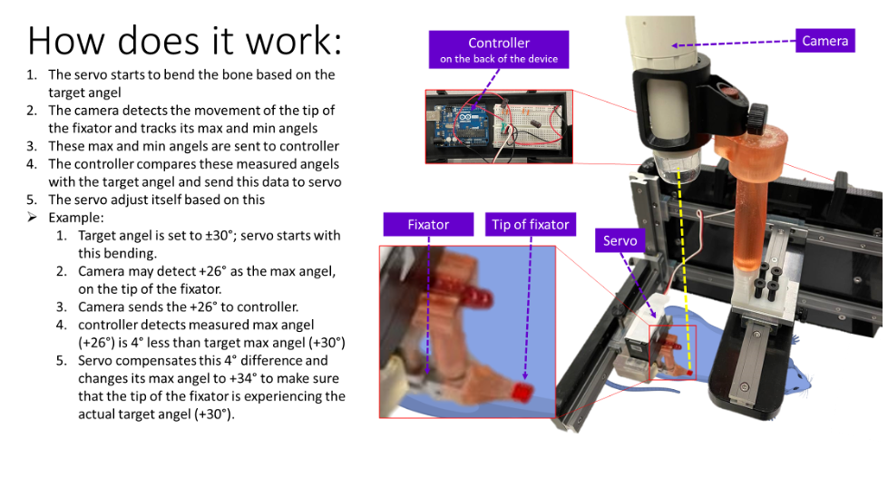

# regenarthrosis

In this project I built a robotic device to induce in vivo formation of cartilage with applying controlled motion to the defect site of rats. This robot’s task is to move bendable fixators, mounted on Rats’ femurs, precisely.
I used CAD (SolidWorks) to design multiple parts and fabricated them by 3D printing or other machining techniques. The parts of the device include but not limited to, a table to have a rat on it, a servo motor to apply bending to the fixators, a controller kit to control the servo motor, grips to attach the fixator to the body of the device, a camera to monitor the performance of the servo motor through motion detect and adjustable arms to hold camera and servo motor in proper positions.

I use Python to control this robotic device and monitor its performance in a feedback loop. This code helps to define any desired mechanical stimulation parameters in terms of the range of bending and also the frequency. I control the servo motor with Arduino kit so I used Pyfirmata package in my python code. On the other hand, I use OpenCV package in python to for object tracking. These two functions are integrated through some global variables which are mutual between the two functions, so when one function changes the values of a global variable the other function will detect it in real-time and adjust its performance. This integration provides us with a feedback loop that not only can apply the desired mechanical stimulations but also can monitor it and make sure that it is applied correctly and consistently as it can adjust the servo motor to compensate for any unpredicted stiffness in the defect site.

